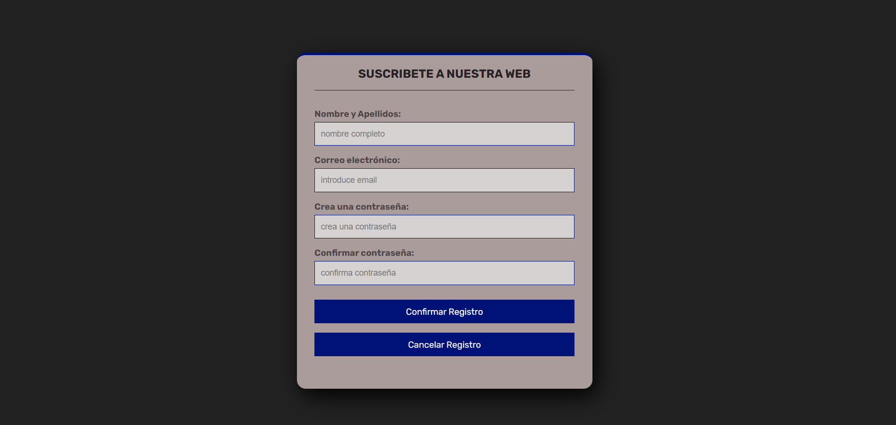
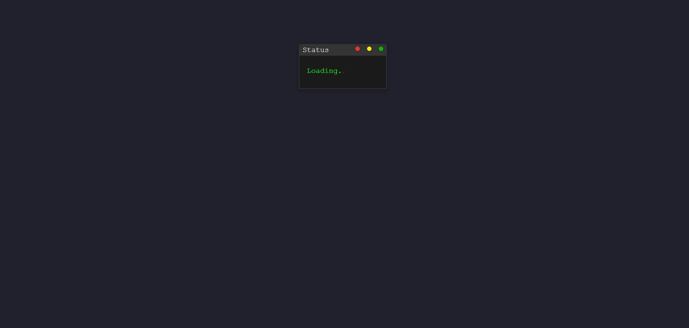
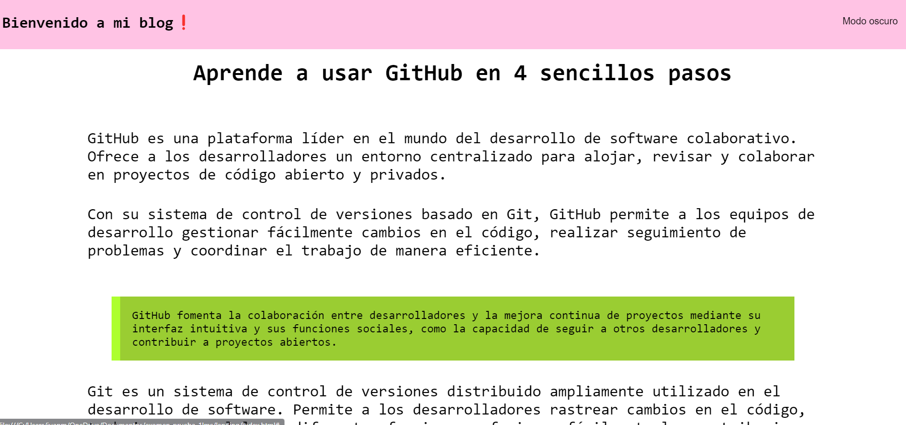
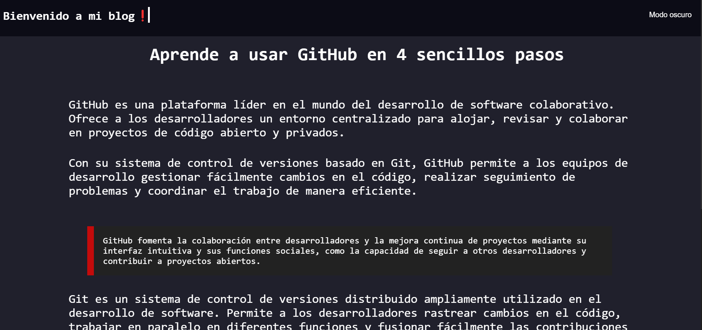
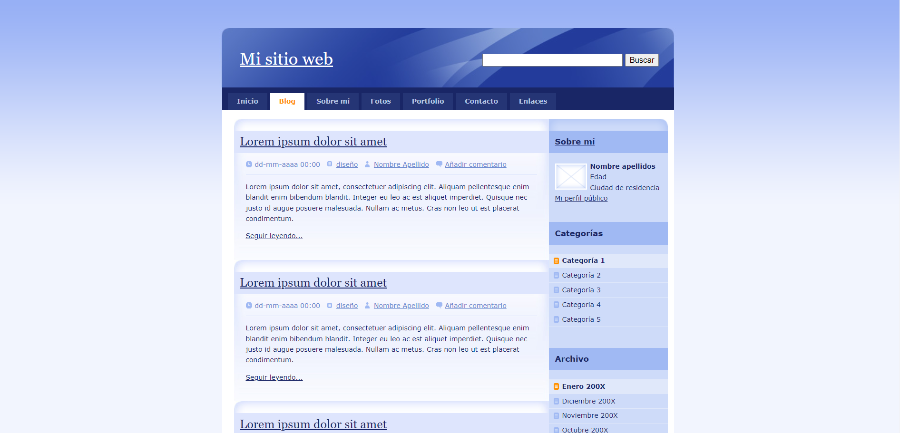

# LOGIN-LANDING-EXAMEN

## Login

> Login recuperando datos del formulario con javascript

## Landing

> Loading al inicio de la página antes de mostrar el blog.

--

> [!NOTE]
> Modo claro de la página
>

> [!NOTE]
> Modo oscuro de la página
>

# Examen web
